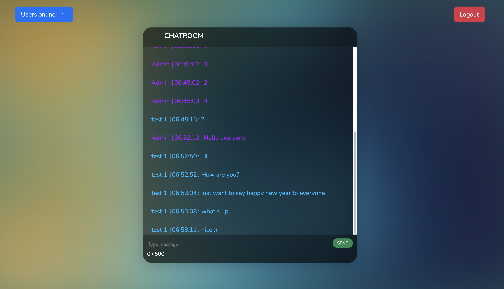

# Introduction
Realtime chat app with Laravel, VueJS, Laravel Echo, SocketIO, Redis using Laravel Public Channel



# Run with Docker
First create `.env` by copying content from `.env.docker.example`:
```
cp .env.docker.example .env
```
In `.env`, if your app uses HTTPS then update `APP_FORCE_HTTPS=true`

Next, for Linux (not needed for Windows and Mac) change ownership of all files in current directory to be under user `1000:1000`:

```
sudo chown -R 1000:1000 .
```
This is because later all containers will run with that user, and since we mount volume from host machine to container, and the permission of files from host container takes precedence therefore we need to sync permission between both environments

> [!TIP]
> You can choose any other user than `1000:1000`, but make sure to use 1 user across steps below

Next build and spin up the project:
```
docker compose up -d --build
```

<details>
  <summary>Next we need to install dependencies for both Laravel and Frontend (VueJS):</summary>
  
  ```shell
  # MacOS + Linux
  docker run --rm -u 1000:1000 -v $(pwd):/app -w /app prooph/composer:8.2 install

  docker run --rm -u 1000:1000 -v $(pwd):/app -w /app prooph/composer:8.2 dump-autoload

  docker run --rm -u 1000:1000 -v $(pwd):/app -w /app node:20-alpine npm install

  docker run --rm -u 1000:1000 -v $(pwd):/app -w /app node:20-alpine npm run build


  # If Windows see below:

  # Git bash
  docker run --rm -u 1000:1000 -v "/$(pwd)":/app -w //app prooph/composer:8.2 install

  docker run --rm -u 1000:1000 -v "/$(pwd)":/app -w //app prooph/composer:8.2 dump-autoload

  docker run --rm -u 1000:1000 -v "/$(pwd)":/app -w //app node:20-alpine npm install

  docker run --rm -u 1000:1000 -v "/$(pwd)":/app -w //app node:20-alpine npm run build

  # PowerShell
  docker run --rm -u 1000:1000 -v "$(pwd):/app" -w /app prooph/composer:8.2 install

  docker run --rm -u 1000:1000 -v "$(pwd):/app" -w /app prooph/composer:8.2 dump-autoload

  docker run --rm -u 1000:1000 -v "$(pwd):/app" -w /app node:20-alpine npm install

  docker run --rm -u 1000:1000 -v "$(pwd):/app" -w /app node:20-alpine npm run build

  # Command Prompt
  docker run --rm -u 1000:1000 -v "%cd%:/app" -w /app prooph/composer:8.2 install

  docker run --rm -u 1000:1000 -v "%cd%:/app" -w /app prooph/composer:8.2 dump-autoload

  docker run --rm -u 1000:1000 -v "%cd%:/app" -w /app node:20-alpine npm install

  docker run --rm -u 1000:1000 -v "%cd%:/app" -w /app node:20-alpine npm run build

  ```
</details>

<br>

Next, generate app key + migrate database:
```shell
docker compose exec app php artisan key:generate

docker compose exec app php artisan migrate
```

Finally you can access the app at `http://localhost:8002`

Adminer (database management) can access the app at `http://localhost:8003`